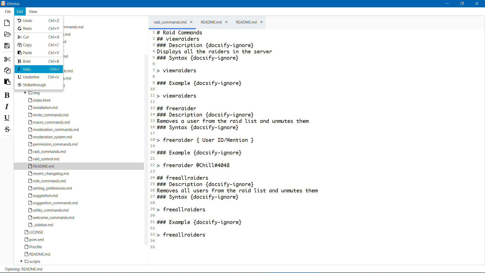

# Omnius

Markdown editor written in Kotlin and TornadoFX.

## Features
* Simple to use
* GitHub integration
* Markdown to PDF support

## Libraries used
* [TornadoFX](https://tornadofx.io/)
* [RichTextFX](https://github.com/FXMisc/RichTextFX)
* [FontAwesomeFX](https://bitbucket.org/Jerady/fontawesomefx)
* [Commonmark Java](https://github.com/atlassian/commonmark-java)